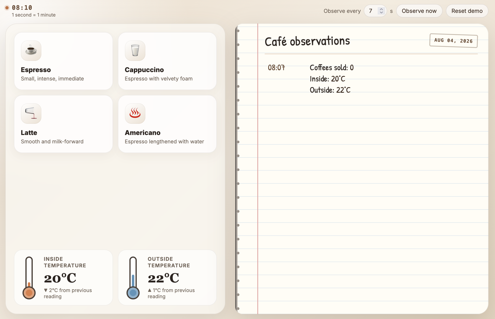

# The Observable Café



An interactive example for teaching metrics, meant to be embedded in a course
one lesson at a time. A café owner sells coffee and keeps an eye on two
thermometers, and every so often writes down what things look like.

Each lesson is the same café with one more idea in it, and has its own URL so a
course page can embed whichever it is currently explaining. They are named after
what they teach rather than numbered, so another can be slotted in anywhere.

| Lesson     | What it teaches                                                    |
| ---------- | ------------------------------------------------------------------ |
| `/samples` | A record is made of samples. What happens between them is not kept. |
| `/labels`  | A measurement can be broken down by a dimension — here, the drink.  |
| `/types`   | A counter and a gauge are different kinds of number.                |

`/` is an index listing the three lessons and linking to the scrape endpoint;
anything unrecognised lands there too. The index is the only place the app
offers `/metrics`: a lesson is embedded in a course page, and pointing away from
that page is the course's business rather than the widget's. A lesson that wants
the endpoint alongside it should link or embed it itself.

## How it is meant to be read

**Selling a coffee changes no number on the page.** A toast confirms the sale
and that is all: the counter behind the till moves, but nobody has written
anything down yet. Seven seconds later the owner looks up and one entry appears,
however many coffees were sold in between. That gap is the point.

**The café runs faster than the world.** One real second is one café minute, so
the clock in the corner sweeps through a working day in about a quarter of an
hour, and the thermometers follow a real daily arc — cool at opening, warmest
mid-afternoon. The temperatures also follow the calendar, so a lesson taken in
January is a colder day than one taken in July.

**The clock does not start until a lesson is opened.** A server nobody has
visited sits at 08:00 with an empty notebook, so the first thing a learner sees
is the café opening rather than however many hours it drifted through while the
process happened to be running. Scraping `/metrics` does not start it either: a
scrape is an observer, not a visitor.

**Opening a different lesson starts the café over**; reloading the one already
showing does not. Each lesson is meant to be arrived at from opening time, but a
learner who refreshes should not lose the coffees they just bought. The page
sends the lesson along with every poll, and the café rebuilds itself only when
that lesson changes.

**The thermometers move every five to ten seconds, and the notebook catches
only some of it.** A rise and fall that happens between two entries leaves no
trace anywhere, which is the failure mode worth meeting early. The gap between
readings is deliberately not a fixed number: weather keeps no schedule, and a
fixed gap against a fixed interval would lock the two together so that the same
movements fell into the same blind spot every time.

**How often the café is written down is the reader's to choose.** The box in the
bar takes anything from 5 to 30 seconds and starts at 7; anything outside that
snaps back, on the page and again at the café, which does not trust a number
that arrived over the wire. Widening it is the lesson: the café goes on moving
at exactly the same rate, and the record simply keeps less of it. Changing it
disturbs nothing — entries just start arriving at the new spacing, so one
notebook holds fine-grained history above and coarse below, to be compared
directly. At 30 seconds the notebook misses about four temperature movements per
entry; at 5 it usually misses none.

Because the café clock runs at a minute a second, the interval is legible in the
record itself — 5 seconds gives `08:00, 08:05, 08:10`, and 30 gives `08:00,
08:30, 09:00`. The note under the clock says so, since otherwise a box reading
"7s" and a notebook showing seven-minute gaps look like a contradiction.

**The charts in `/types` fit their readings, not the thermometer.** Drawn
against everything the instrument could possibly show, an ordinary afternoon
occupies under a third of the height and a degree is worth about two pixels —
so the café looks becalmed when it is not. Each chart therefore fits the window
it is showing, never narrower than six degrees, which keeps a genuinely quiet
stretch looking quiet instead of turning noise into a mountain range. Because
the scale moves, each chart says underneath what it is fitted to. The
thermometers keep their fixed printed range, as a physical instrument would.

**A lesson left open runs past midnight**, so the owner rules off and heads the
new day, and the date beside the title follows the newest entry rather than
opening day. Nights are cold, which the calendar already handles.

This has nothing to do with the interval: the café clock advances a minute per
second of being watched, so midnight always arrives sixteen minutes after the
lesson is opened. The interval only decides how many entries span that.

**`/metrics` is a separate page, not a panel.** It is plain text, byte-identical
to what `curl` sees, and it does not update on its own. Reloading it *is* a
scrape — nothing pushed those numbers anywhere; something came and asked. It
reports the café as it stands the instant it is asked and stores nothing, so its
numbers run ahead of the notebook's.

## Development

```shell
dx serve
```

Then open <http://localhost:8080> for the index, or go straight to a lesson at
<http://localhost:8080/samples>. The scrape endpoint is at
<http://localhost:8080/metrics>.

Run `dx serve --args "--disable-automatic-observations"` to stop the server
adding notebook entries on a timer and hide the observation controls.

```shell
dx build --release   # bundles into target/dx/observable-cafe/release/web/public
cargo clippy --no-default-features --features server
cargo clippy --target wasm32-unknown-unknown --no-default-features --features web
cargo fmt
```

The `web` and `server` features pick which half of the app is being built; `dx`
sets them for you.

## Layout

| Path                       | Contents                                            |
| -------------------------- | --------------------------------------------------- |
| `src/route.rs`             | Where each lesson lives                             |
| `src/lesson.rs`            | What each lesson teaches, shows and does not show   |
| `src/app.rs`               | Root component: polling, page layout                |
| `src/components/`          | Menu, thermometers, notebook, cards, sparkline      |
| `src/clock.rs`             | The café's own clock, which everything reads time from |
| `src/menu.rs`              | What the café sells, and the label values it publishes |
| `src/state.rs`             | What the server observes and hands to the browser   |
| `src/season.rs`            | What the calendar says a thermometer should read    |
| `src/api.rs`               | Server functions the browser calls                  |
| `src/server.rs`            | The café: in-memory state and the axum router       |
| `src/server/simulation.rs` | Readings that move on their own                     |
| `src/server/metrics.rs`    | The `/metrics` scrape endpoint                      |
| `src/server/rng.rs`        | Seeded xorshift used to simulate readings           |
| `assets/main.css`          | Styles                                              |

## Metrics

```
cafe_coffees_sold_total{drink="…"}   counter, one series per drink sold
cafe_inside_temperature_celsius      gauge
cafe_outside_temperature_celsius     gauge
```

There is one `/metrics`, and it is the same for every lesson: always the full
exposition, so it always looks like a real target.

A drink nobody has ordered has no series at all, rather than a series reading
zero — a series begins when something is first observed under it, which is why
graphs come out with gaps in them.

There is deliberately no unlabelled `cafe_coffees_sold_total` alongside the
per-drink series: a total published next to its own breakdown would be counted
twice by anything summing the lot. The notebook still writes a total, because a
person keeping notes wants the headline; adding the series up is the reader's
job.

## Known gap

The café is a single global (`src/server.rs`), so every visitor shares one
counter and one notebook. That is what lets a cookie-less `curl` see the same
numbers as the page — but it also means another learner's purchases arrive as
unexplained coffees, which undercuts `/samples`, where the lesson depends on
being able to check that you clicked three times and one entry appeared. Scoping
state per visitor would fix the lesson and break the `curl`; it has not been
decided yet.

Since the café is also set up for one lesson at a time, two people reading
different lessons at once is now worse than untidy: each of their polls switches
the café to their own lesson, so both reset it about once a second and neither
notebook ever fills. The observation interval is shared the same way — the last
poll wins — so two readers who have chosen different intervals will pull the
cadence back and forth between them. Neither is destructive, but concurrent use
needs the state-scope question settled first. A single reader, or several
reading the same lesson at the same interval, is fine.

Relatedly, the global `Mutex` and the long-lived background task rule out plain
Cloudflare Workers. Publishing there would need Durable Objects, or a host that
can keep a process running.
